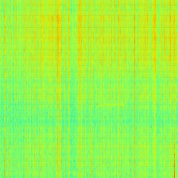
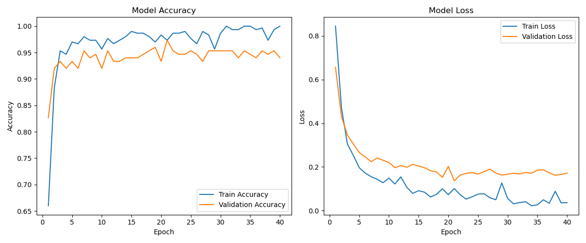
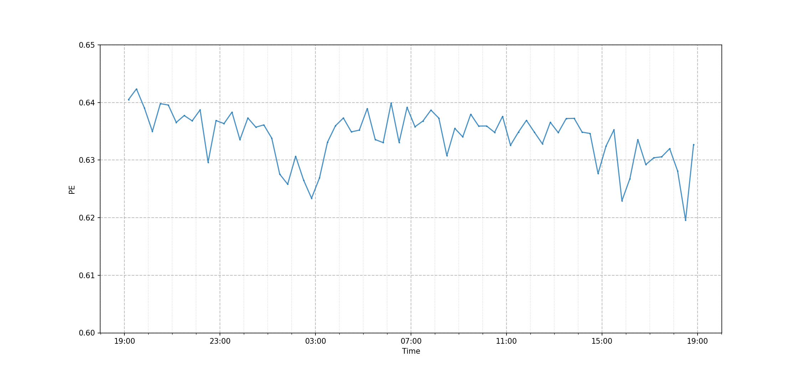
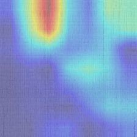

# Identification and Visualization of Permutation Entropy Variations in Seismic Noise Before and After Eruptive Activity Using CNN

## 概要
火山噴火の予測指標として注目される「順列エントロピー（Permutation Entropy; PE）」の有効性を、深層学習を用いて検証した研究コードです。

霧島山新燃岳の噴火現象の前後に観測された地震ノイズをスペクトログラム画像に変換し、CNN（EfficientNet-B0）を用いて噴火段階の識別を行いました。

さらに、Grad-CAMを用いてモデルの識別根拠を可視化することで、深層学習モデルが「PEの減少」という物理的特徴を正しく捉えているかを検証しています。

情報処理学会 第88回全国大会にて発表した内容です。

## 本研究のポイント
* 客観的な特徴抽出
  事前知識によるバイアスを排除し、深層学習を用いることで機械的かつ客観的に地震波の特徴を抽出・識別しました。
* Grad-CAMによる根拠可視化（ブラックボックスの解消）
  モデルが画像内のどこに着目して分類したかを可視化し、PEが減少するタイミングと一致していることを確認しました。

## データセットについて
Japan Volcanological Data Network (JVDN) から取得した時系列データを使用しています。

本研究で使用した時系列データは本リポジトリに含めていません。

## 手法

### 1. データ前処理
* 地震計の時系列データを1Hz〜7Hzでフィルタリング
* STFT（短時間フーリエ変換）を用いて、24時間分の時系列データからスペクトログラム画像を作成

*図1: モデルの入力として作成したスペクトログラム画像の例（横軸：時間、縦軸：周波数）*

### 2. モデルアーキテクチャ
* ベースモデル: EfficientNet-B0 (ImageNet事前学習済み)
* 学習アプローチ: 2段階の転移学習
  * Phase 1 (Head): 全結合層のみを学習（Epochs: 20, LR: 1e-3）
  * Phase 2 (Fine-Tuning): 全層の学習（Epochs: 20, LR: 1e-5, Cosine Annealing）

### 3. 識別精度
9つの異なる乱数シードを用いて評価
| Metric | Mean | Std | Max | Min |
| :--- | :--- | :--- | :--- | :--- |
| Accuracy | 0.9548 | 0.0176 | 0.9733 | 0.9267 |
| Precision (II) | 0.9210 | 0.0238 | 0.9600 | 0.8980 |
| Recall (II) | 0.9467 | 0.0583 | 1.0000 | 0.8200 |
| F1-score (II) | 0.9435 | 0.0288 | 0.9608 | 0.8817 |

*図2: 学習時のAccuracyおよびLossの推移*

### 4. 識別根拠の可視化 (Grad-CAM)
噴火直前のクラス（Period II）に対するモデルの着目領域を可視化

*図3: 噴火直前における順列エントロピー(PE)の変動*

*図4: Grad-CAMによるヒートマップ*

## ディレクトリ構成
コードは `src/` ディレクトリに入れています。

* `train.py`: 学習・評価・可視化を一貫して実行するメインのコード
* `utils_config.py`: デバイス設定や乱数シード固定などの設定
* `utils_data.py`: データ前処理およびDataLoaderの構築
* `utils_model.py`: EfficientNet-B0の初期化と全結合層の調整
* `utils_train.py`: 転移学習
* `utils_eval.py`: 精度指標の計算
* `utils_gradcam.py`: Grad-CAMによるヒートマップ生成
